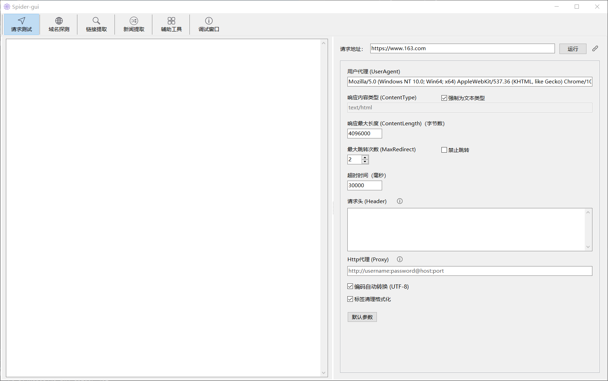
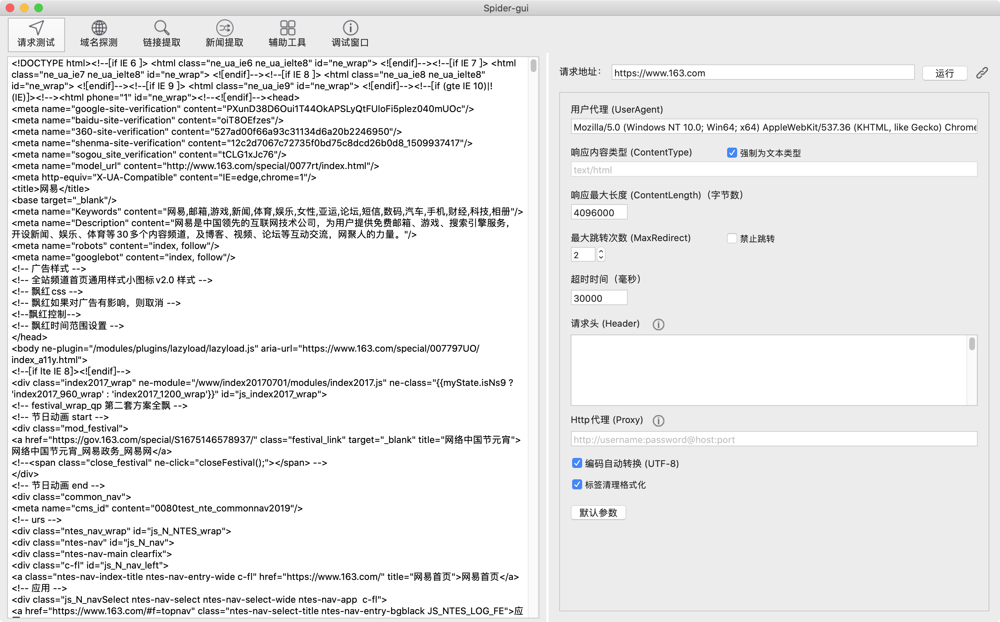

通用网站采集库 [go-pkg-spider](https://github.com/suosi-inc/go-pkg-spider) GUI 功能演示。

## 下载

待更

## 界面预览

### Win10

<p align="center" markdown="1" style="max-width: 100%">
  
</p>

### MacOS

<p align="center" markdown="1" style="max-width: 100%">
  
</p>

## 项目构建

本项目基于跨平台的 Golang GUI 库 [govcl](https://github.com/ying32/govcl) v2.2.0

### 安装 Lazarus

安装对应的 Lazarus 2.2.0，用于可视化设计。官网下载： [Lazarus](https://www.lazarus-ide.org/index.php?page=downloads) 

Windows 版本默认集成了 fpc、fpc-src、gdb等，直接下载安装 `Windows (64 Bits)` 版本即可

MacOS 依次安装： `fpc -> fpc-src -> lazarus`

Linux 依次安装： `fpc-laz -> fpc-src -> lazarus`

#### 窗口停靠

默认 Lazarus IDE 是窗口分离模式，可以通过以下方法重新编译 IDE 切换窗口停靠模式：

`包 -> 安装卸载包 -> 右侧双击选择 'anchordockingdsgn'、'dockerformeditor' -> 保存并重建IDE`，等待构建后重启

> 很遗憾，MacOS 的切换窗口停靠后，运行会产生莫名奇妙的 Bug，折腾未果。

#### res2go

安装 govcl 官方的 Lazarus 插件： [res2go](https://github.com/ying32/res2go-ide-plugin)，用于同步生成 Golang 代码。

本项目配置：

* 不使用默认的 `winappres`
* 输出路径使用环境变量：`$Path($ProjectFile())../`，包名：`gui`，输出语言：Go。即代码输出到项目的 `/gui` 目录中
* 使用 `tempdll`约束，使用 `go:embed`
* Build mode：`exe` (针对 Windows)

### Windows 构建

```
go mod download

# Windows 下隐藏 cmd 窗口，并且将 liblcl 打包到可执行文件内，
go build -ldflags "-H windowsgui" -tags tempdll -o bin/win64

# 缩小构建大小：-s 去掉符号信息, -w 去掉 DWARF 调试信息
go build -ldflags "-w -s -H windowsgui" -tags tempdll -o bin/win64
```

### MacOS 构建


```
go mod download

go build -o bin/macos64
```

## 注意事项

### 关于 DPI Awareness

当需要跨平台构建打包时，可能涉及 DPI (高分屏) ，需要在构建前打开 Lazarus 工程同步一次工程（随便改点啥，触发 res2go ）

Lazarus 会根据当前系统屏幕重置 DesignTimePPI/DPI，自动调整元素大小，生成工程文件。

当前采用 `PerMonitorV2`